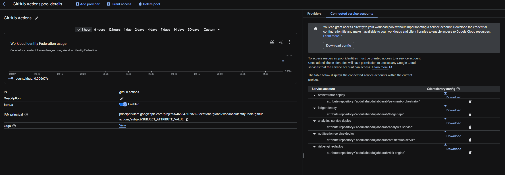
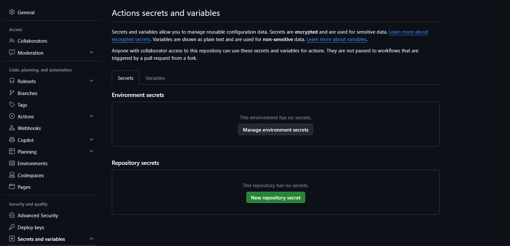
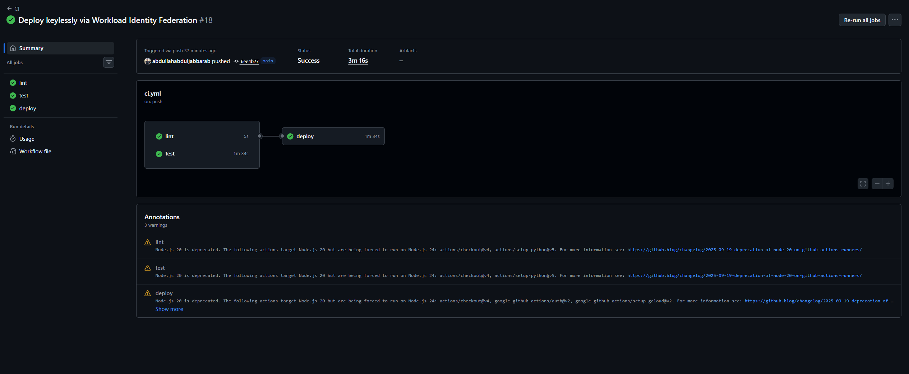
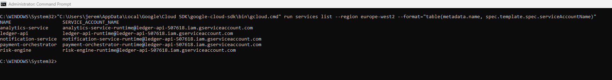
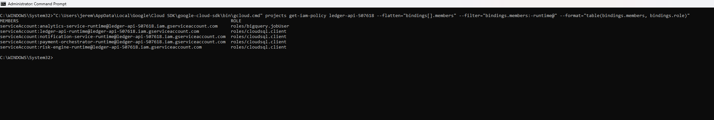
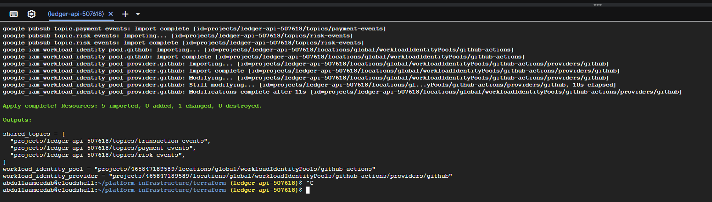
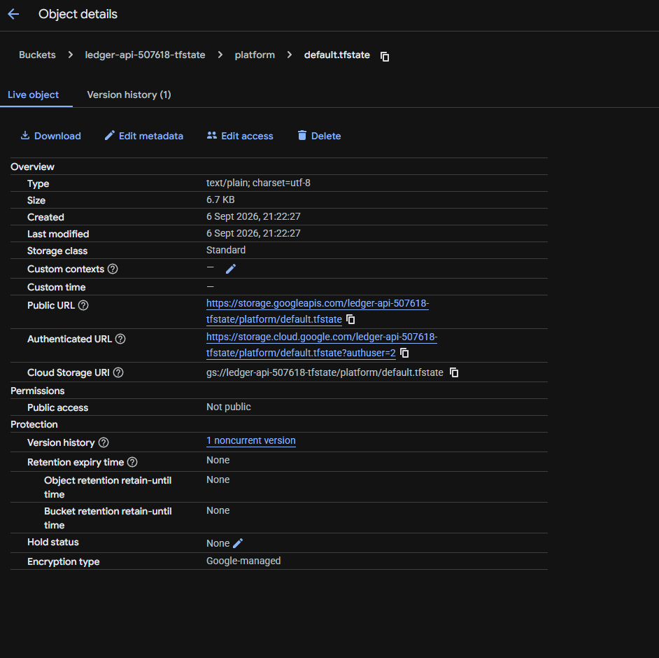

# Platform Infrastructure

Shared, cross-cutting infrastructure for [ABS Financial Systems](https://github.com/abdullahabduljabbarab/abs-financial-systems). This repository owns the resources that belong to no single service, and the ecosystem's deployment and security posture: keyless CI/CD for every service, one authoritative definition for shared infrastructure, and explicit ownership of every resource.

It holds no application code. Its content is Terraform (with remote state), the resource-ownership charter, and the runbook for the migration that removed the last long-lived deployment keys from the platform.

Its engineering claim: **existing live cloud infrastructure was migrated to centrally-owned Terraform state while preserving service availability, every application deployment uses repository-scoped keyless OIDC federation rather than a stored cloud credential, and every service runs under a dedicated least-privilege runtime identity rather than a shared default account.**



## What this repository establishes

- **Zero long-lived CI/CD credentials.** Every service repository deploys through Workload Identity Federation, presenting a short-lived GitHub OIDC token that GCP exchanges to impersonate a repository-scoped deploy service account. No service-account JSON key is stored in any repository, and the one historical shared key was revoked.
- **Shared infrastructure as code, with remote state.** The resources no one service owns, the Workload Identity pool and provider and the shared Pub/Sub topics, are defined here in Terraform against a versioned GCS remote-state backend. Existing live resources were adopted incrementally with `terraform import`, five imported, none added, none destroyed, never recreated, so the running platform was never disrupted.
- **Dedicated least-privilege runtime identities.** Every service runs under its own runtime service account, not the shared default compute account. Each holds only Cloud SQL Client, read access to its own secrets, and publisher on its own topic where it produces events, so no runtime identity carries ambient project authority.
- **Explicit resource ownership.** Every resource has exactly one owning repository, recorded in [`docs/RESOURCE_OWNERSHIP.md`](docs/RESOURCE_OWNERSHIP.md), so no two repositories half-declare the same thing.

## The ecosystem this completes

| Service | Owns | Deploys via |
|---|---|---|
| ledger-api | authoritative double-entry money | keyless WIF |
| payment-orchestrator | payment lifecycle / saga | keyless WIF |
| risk-engine | deterministic decisioning | keyless WIF |
| notification-service | isolated downstream side effects | keyless WIF |
| analytics-service | event-sourced CQRS projections | keyless WIF |
| **platform-infrastructure** | **shared infra + platform security posture** | Terraform (remote state) |

The statement this earns: **five independently deployed services, zero long-lived CI cloud credentials, repository-scoped OIDC federation, dedicated least-privilege runtime identities, explicit infrastructure ownership, and shared GCP infrastructure managed as code.**

## Keyless deployment, proven

Every service repository federates into one Workload Identity pool, each `<service>-deploy` account bound to exactly its own repository (above). The other half of the property is that the key is gone: the ledger and orchestrator, the last two on a stored `GCP_SA_KEY`, were migrated one at a time, each verified green and healthy before its key was deleted.

| No stored key | A keyless deploy |
|---|---|
|  |  |

The historical shared `github-deploy` account (whose JSON key had been the stored secret) was revoked and deleted, so the credential is dead on both ends: no stored secret, and no key in GCP.

## Dedicated runtime identities, proven

Keyless deployment removes the shared credential from CI; the matching property at runtime is that no service runs as the shared default compute account either. Every service was moved onto its own `<service>-runtime` account, one at a time, safest first (notification, risk, orchestrator, ledger), each verified live before the next: the runtime account switched on the running revision, `/health` returned `database: connected`, and a real payment ran end to end (a customer notification delivery, a published risk decision, a settled payment with reserve and capture, and reconciling ledger balances).



Each runtime identity is least-privilege, not merely dedicated. At the project level it holds only `cloudsql.client` (analytics, `bigquery.jobUser`), no Editor or Owner, no ambient authority; its secret reads and topic-publish rights are granted per resource, on that one secret and that one topic, so the blast radius of any single runtime identity is small. The per-resource grants are recorded in [`docs/RESOURCE_OWNERSHIP.md`](docs/RESOURCE_OWNERSHIP.md).



## Shared infrastructure, adopted into Terraform state

The Workload Identity pool and provider and the three shared event topics were created by gcloud as the ecosystem was built. Rather than recreate them, they were adopted into Terraform with Terraform 1.5 import blocks against a versioned GCS remote-state backend. The plan reconciled the config against the live resources:

```
Plan: 5 to import, 0 to add, 1 to change, 0 to destroy.
```

Four imported with no changes; the WIF provider took one deliberate, cosmetic change, setting a `display_name` it had never been given (its issuer, attribute mapping and condition were unchanged). The apply completed cleanly:

```
Apply complete! Resources: 5 imported, 0 added, 1 changed, 0 destroyed.

$ terraform state list
google_iam_workload_identity_pool.github
google_iam_workload_identity_pool_provider.github
google_pubsub_topic.payment_events
google_pubsub_topic.risk_events
google_pubsub_topic.transaction_events
```

| The adoption (import + apply) | The remote state |
|---|---|
|  |  |

Existing shared resources are now genuinely Terraform-managed with remote state, adopted incrementally without recreation and without disrupting a live service. The Cloud SQL instance is deliberately left as a data source owned by the ledger, and project-level IAM is left for a later careful pass (see [`docs/DECISIONS.md`](docs/DECISIONS.md)).

## Contents

- [`docs/ARCHITECTURE.md`](docs/ARCHITECTURE.md) — the shared-infrastructure and identity architecture.
- [`docs/RESOURCE_OWNERSHIP.md`](docs/RESOURCE_OWNERSHIP.md) — one owner per resource.
- [`docs/DECISIONS.md`](docs/DECISIONS.md) — the decisions and their trade-offs as ADRs.
- [`docs/MIGRATION_RUNBOOK.md`](docs/MIGRATION_RUNBOOK.md) — the keyless-deploy migration and the Terraform adoption procedure.
- [`docs/SECURITY.md`](docs/SECURITY.md), [`docs/THREAT_MODEL.md`](docs/THREAT_MODEL.md) — the platform security posture and its attack surface.
- [`docs/PRODUCTION_LOG.md`](docs/PRODUCTION_LOG.md) — the build and migration record.
- [`terraform/`](terraform/) — the shared infrastructure, with remote state.
